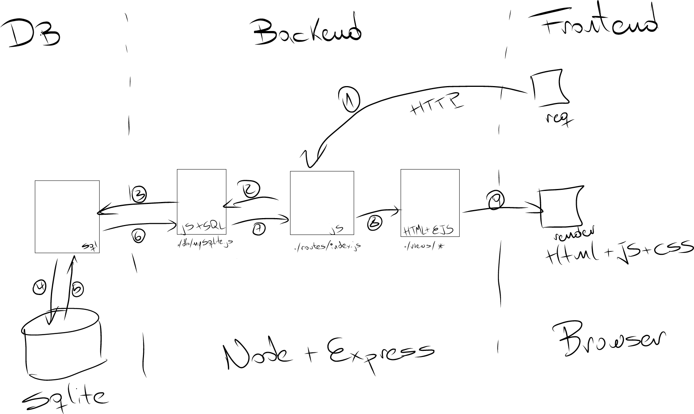

# INVESTORY - STOCK BOOKKEEPING APPLICATION
Investory is a basic NodeExpress-SQLite-EJS Application which allows trader to mark their transactions, and view them conveniently by searching for their trader ID.


## Using it

1) Clone the repo
2) Install the dependencies

```
npm install
```


3) Start the server

```
npm start
```

4) Point your browser to http://locahost:3000


## Architecture

